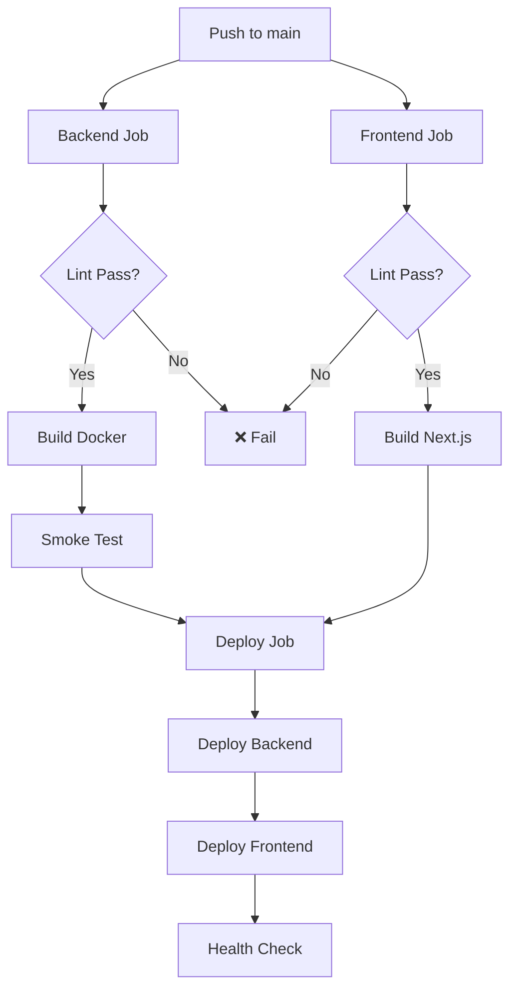

# CI/CD Pipeline - Production Ready Checklist

## ✅ What's Been Fixed

### 1. **Node Version Consistency**
- ✅ Updated backend CI to use Node 20 (matching Dockerfile)
- ✅ Centralized version in env variable

### 2. **Error Handling**
- ✅ Removed `|| true` - builds now fail on lint errors
- ✅ Added deployment response validation
- ✅ Proper exit codes on failure

### 3. **Performance & Caching**
- ✅ Backend now uses npm cache
- ✅ Frontend uses official pnpm action with better caching
- ✅ Build artifacts uploaded for debugging

### 4. **Security**
- ✅ Deploy hooks validated without exposing URLs
- ✅ Deployments only on main branch pushes
- ✅ GitHub environments for production tracking

### 5. **Docker**
- ✅ Added smoke test for built image
- ✅ Tagged with commit SHA for traceability

### 6. **Missing Files Created**
- ✅ Added ESLint config for server
- ✅ Added test scripts (placeholder)

---

## 📋 Current Pipeline Flow



---

## 🚀 What Happens on Each Push

1. **Backend Pipeline**:
   - Checkout code
   - Install dependencies (cached)
   - Lint JavaScript files
   - Build Docker image
   - Test Docker image runs

2. **Frontend Pipeline**:
   - Checkout code
   - Install pnpm dependencies (cached)
   - Lint code
   - Build Next.js (production mode)
   - Upload artifacts

3. **Deploy Pipeline** (only on main):
   - Deploy backend to Render
   - Deploy frontend to Vercel
   - Wait for deployments
   - (Optional) Health checks

---

## ⚙️ GitHub Secrets Required

Make sure these are set in your repo: Settings → Secrets and variables → Actions

```
RENDER_DEPLOY_HOOK      # Render webhook URL
VERCEL_DEPLOY_HOOK      # Vercel deploy hook URL
```

---

## 🔨 Future Improvements

### High Priority
- [ ] Add actual tests (Jest/Vitest)
- [ ] Add database migrations check
- [ ] Add health check endpoints
- [ ] Add rollback strategy

### Medium Priority
- [ ] Add staging environment
- [ ] Add E2E tests (Playwright)
- [ ] Add security scanning (Snyk/Trivy)
- [ ] Add performance budgets

### Nice to Have
- [ ] Add automatic PR previews
- [ ] Add Slack/Discord notifications
- [ ] Add dependency update automation
- [ ] Add code coverage reports

---

## 📊 Monitoring

After deployment, monitor:
- Render logs: https://dashboard.render.com/
- Vercel logs: https://vercel.com/dashboard
- GitHub Actions: https://github.com/YOUR_USERNAME/Prompt-Studio/actions

---

## 🔍 Testing Locally

Before pushing, run:

```bash
# Backend
cd server
npm run lint
docker build -t test-backend .
docker run -p 5000:5000 test-backend

# Frontend
cd client
pnpm lint
pnpm build
```

---

## 🐛 Troubleshooting

### Build fails on linting
- Fix lint errors locally first
- Run `npm run lint` or `pnpm lint`

### Docker build fails
- Check Dockerfile syntax
- Verify all dependencies in package.json

### Deploy hook fails
- Verify secrets are set correctly
- Check webhook URLs are valid
- Check Render/Vercel service status

---

## ✨ Production Ready Score: 8/10

**Strengths:**
- ✅ Proper error handling
- ✅ Caching implemented
- ✅ Docker validation
- ✅ Environment protection
- ✅ Artifact preservation

**Areas to Improve:**
- ⚠️ No actual tests yet
- ⚠️ No health checks implemented
- ⚠️ No rollback strategy

---

**Next Steps:** When you're ready to add tests, uncomment the test steps in the workflow and implement proper test suites.
